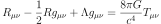
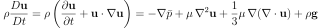
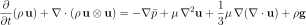
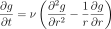
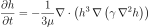

# Differential-Equations
Differential equation solving in Python and C/C++

## Table of Contents
- Physics
    - Continuity equation
    - Diffusion equation
    - Heat equation
    - Eikonal equation
    - Euler-Lagrange equation
    - Geodesic equation
    - Hamilton's equations
    - KdV equation
    - Lane-Emden equation
    - Laplace's equation
    - London equations
    - Lorenz equations
    - Newton's law of cooling
    - Nonlinear Schrödinger equation
    - Poisson's equation
    - Poisson-Boltzmann equation
    - Radioactive decay equation
    - Universal differential equation
    - Wave equation
    - Yang-Mills equations
    - Convection-diffusion equation
    - Geophysical fluid dynamics
    - Potential vorticity
    - Quasi-geostrophic equations
    - Shallow water equations
    - n-body problem
    - Navier-Stokes equations
    - Euler equations
    - Burgers' equation
    - Wave action
    - Maxwell's equations
    - Lorentz force law
    - The Einstein field equations (EFE)
    - Schrödinger's equation
    - Dirac equation
    - Klein-Gordon equation
    - Schwinger-Dyson equation
- Engineering
    - Chemical reaction model
    - Elasticity
    - Euler-Bernoulli beam theory
    - Timoshenko beam theory
    - Neutron diffusion
    - Optimal control
    - Linear-quadratic regulator
    - Matrix differential equation
    - PDE-constrained optimization
    - Shape optimization
    - Spherical harmonics
    - Associated Legendre polynomials
    - Telegrapher's equations
    - Total variation denoising (Rudin-Osher-Fatemi)
    - Traffic flow
    - Van der Pol oscillator
- Fluid dynamics and hydrology
    - Acoustic theory
    - Blasius boundary layer
    - Buckley-Leverett equation
    - Groundwater flow equation
    - Richards equation
    - Magnetohydrodynamics
    - Potential flow
    - Rayleigh-Plesset equation
    - Reynolds-averaged Navier-Stokes (RANS) equations
    - Reynolds transport theorem
    - Riemann problem
    - Turbulence kinetic energy (TKE)
    - Vorticity equation
- Biology and medicine
    - Allee effect
    - Chemotaxis
    - Compartmental models
        - SIR model
        - SIS model
    - Hagen-Poiseuille equation
    - Hodgkin-Huxley model
    - McKendrick-von Foerster equation
    - Nernst-Planck equation
    - Price equation
    - Reaction-diffusion equation
    - Fisher-KPP equation
    - FitzHugh-Nagumo model
    - Replicator dynamics
    - Verhulst equation
    - von Bertalanffy model
    - Wilson-Cowan model
    - Young-Laplace equation
    - Lotka-Volterra equations
- Chemistry
    - Rate laws/equations

### Notorious PDEs

These PDEs are generally regarded by the community (or by me in some cases) as being quite difficult to nearly impossible to solve analytically. Simulating these numerically is my long-term goal.

- Primitive Equations
    - ![$\begin{aligned}\frac{dv}{dt}&=-(1/\rho)\nabla p-g(r/r)+f_{r}\\ g&=g_e\\ \frac{dv}{dt}&=-(1/\rho)\nabla p-g(r/r)+(1/\rho )\left[\nabla\cdot (\mu\nabla v)+\nabla (\lambda\nabla\cdot v)\right]\\ c_{v}\frac{dT}{dt}+p\frac{d\alpha}{dt}&=q+f\\ \frac{d\rho}{dt}+\rho\nabla\cdot v&=0\\ p&=nT\\ \end{aligned}$](svg/primitive_equations.svg)
- Einstein Field Equations
    - 
- Navier-Stokes Equations
    - Convective Form
        - 
    - Conservation Form
        - 
- Maxwell's Equations
    - 
- Shallow Water Equations
    - Conservative Form
        - 
    - Non-Conservative Form
        - ![$\begin{aligned}\frac{\partial h}{\partial t}+\frac{\partial}{\partial x}\Bigl((H+h)u\Bigr)+\frac{\partial}{\partial y}\Bigl((H+h)v\Bigr)&=0\\\frac{\partial u}{\partial t}+u\frac{\partial u}{\partial x}+v\frac{\partial u}{\partial y}-fv&=-g\frac{\partial h}{\partial x}-bu+\nu\left(\frac{\partial^2u}{\partial x^2}+\frac{\partial^2u}{\partial y^2}\right)\\ \frac{\partial v}{\partial t}+u\frac{\partial v}{\partial x}+v\frac{\partial v}{\partial y}+fu&=-g\frac{\partial h}{\partial y}-bv+\nu\left(\frac{\partial^2v}{\partial x^2}+\frac{\partial^2v}{\partial y^2}\right)\\ \end{aligned}$](svg/shallow_water_equations_nonconservative.svg)
- Universal Differential Equation(s)
    - ?

#### Honorable Mention
These might not be as ubiquitous or challenging to solve, but I still find them cool and want to simulate them. I might move them to the main list in the future...
- Lamb-Oseen Vortex
    - 
- Thin-Film Equation
    - 
- Vorticity Equation
    - 
